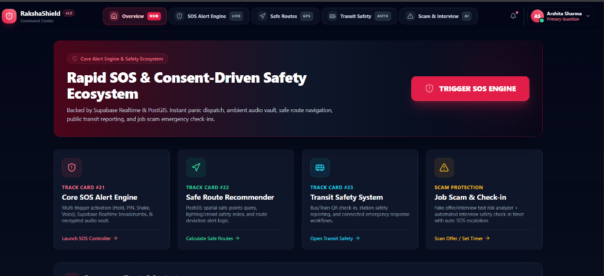
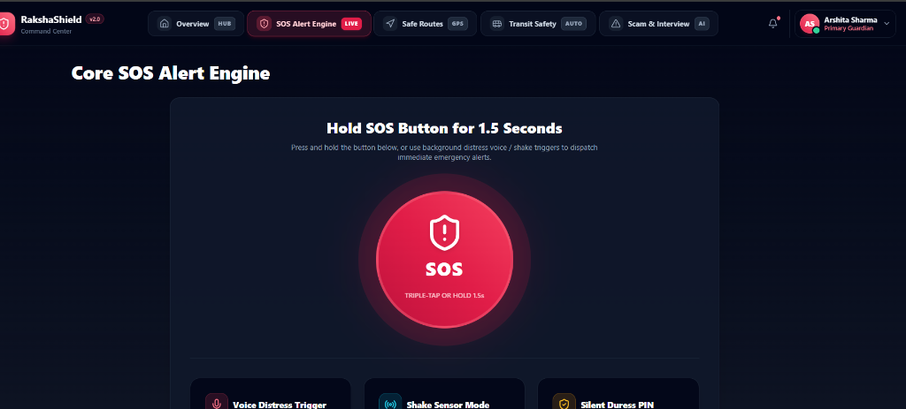
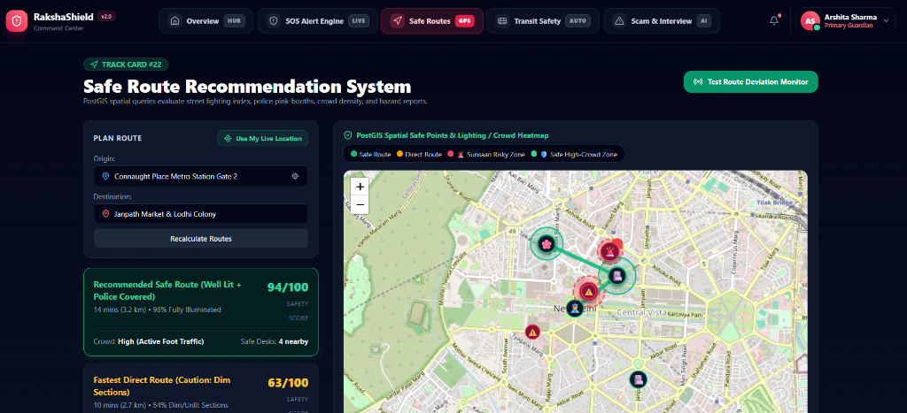
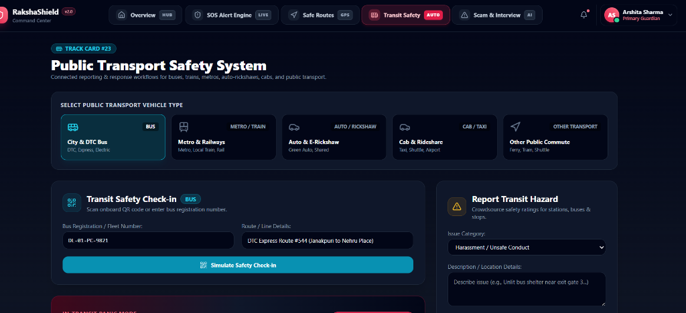
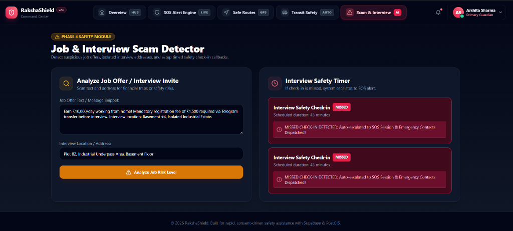

# 🛡️ RakshaShield (NirbhayaShield v2.0)

> **Next-Gen Women & Citizen Safety Platform with AI Emergency SOS, Real-Time Dispatch, Safe Route Navigation, Public Transit Protection, and Scam Detection.**

[](https://nextjs.org/)
[](https://reactjs.org/)
[](https://www.typescriptlang.org/)
[](https://tailwindcss.com/)
[](https://supabase.com/)
[](LICENSE)

---

## 📌 Overview

**RakshaShield** is a comprehensive, real-time safety ecosystem engineered to protect women, commuters, and citizens in critical or high-risk situations. Combining **0ms instant emergency dispatches**, **AI-driven scam detection**, **spatial safe route navigation**, and **public transit monitoring**, RakshaShield ensures rapid response, continuous situational awareness, and seamless communication with trusted contacts and emergency police responders.

---

## 🔥 Key Features

### 🚨 1. Core 0ms Instant SOS Engine
- **Simulate Shake Activation**: Instant 0ms panic trigger via accelerometer / gesture simulation.
- **Silent Duress PIN (`0000`)**: De-escalation mechanism that appears to cancel the alarm while covertly alerting police and emergency contacts.
- **Voice Keyword Activation**: Hands-free SOS trigger listening for custom voice phrases (e.g., *"Raksha Help"*).
- **Fake Caller Decoy**: Generates an incoming call overlay to provide a believable pretext for stepping away from unsafe situations.
- **Emergency Audio & Location Streaming**: Real-time breadcrumb streaming with battery percentage, speed, and location telemetry.

### 🗺️ 2. Spatial Safe Route Navigator & Hotspots
- **Dual Route Engine**: Compare **Safest Route** (well-lit, high footfall, Pink Booth coverage) vs. **Fastest Route**.
- **Interactive Spatial Hotspots**: Visualizes **Risky Sunsaan Zones** (isolated/dark underpasses) alongside **Safe High-Crowd Zones** (Police Stations, 24/7 Pharmacies, Pink Booths, Hospitals).
- **Route Deviation Alerts**: Automatic detection and emergency warnings if a user strays from their intended path.

### 🚍 3. Public Transit & Bus Safety Guardian
- **Vehicle Check-In**: Track DTC buses, cabs, auto-rickshaws, and metro connections by vehicle ID.
- **Safety Rating & Crowd Meter**: Real-time crowd index, lighting score, and driver rating analysis.
- **Trip Safeguards**: Automated departure countdowns and quick-access emergency dispatch buttons tailored for public transit commuters.

### 🔍 4. AI Job & Interview Scam Detector
- **Pattern Recognition**: AI analysis of job offers and interview invites to identify red flags (upfront registration fees, Telegram-only contact, isolated basement locations, salary anomalies).
- **Risk Score Breakdown**: Detailed rating (High Risk / Suspicious / Verified) with actionable safety advice.
- **Timed Check-In Safeguard**: Schedule automated safety check-in countdowns when attending interviews; failsafe triggers SOS dispatch if unconfirmed.

### 🚓 5. Admin & Police Responder Command Hub
- **Live Dispatch Queue**: Real-time incident feed for active emergency dispatches and crowdsourced community hazards.
- **Command Map & Telemetry**: Dynamic map displaying victim location, breadcrumb trails, and nearby responder units.
- **Responder Roster & Direct Call**: Quick access to registered emergency contacts and station dispatchers.
- **Row Level Security (RLS) Status**: Status indicator verifying database encryption and security enforcement.

### 📡 6. Secure Public Tracking Page
- **Tokenized Access**: Shareable tracking link (`/track/[token]`) for family members and police responders without requiring app login or registration.

---

## 📸 Application Screenshots

<table width="100%">
  <tr>
    <td width="50%" align="center">
      <b>1. Overview Command Hub & Ecosystem</b><br/><br/>
      
    </td>
    <td width="50%" align="center">
      <b>2. Core SOS Alert Engine</b><br/><br/>
      
    </td>
  </tr>
  <tr>
    <td width="50%" align="center">
      <b>3. Spatial Safe Route System</b><br/><br/>
      
    </td>
    <td width="50%" align="center">
      <b>4. Public Transport Safety System</b><br/><br/>
      
    </td>
  </tr>
  <tr>
    <td colspan="2" align="center">
      <b>5. AI Job & Interview Scam Detector</b><br/><br/>
      
    </td>
  </tr>
</table>

---

## 🛠️ Tech Stack

| Category | Technology |
| :--- | :--- |
| **Framework** | [Next.js 14](https://nextjs.org/) (App Router, Server & Client Components) |
| **Language** | [TypeScript](https://www.typescriptlang.org/) |
| **Styling & UI** | [Tailwind CSS](https://tailwindcss.com/), [Lucide React Icons](https://lucide.dev/) |
| **Mapping & Spatial** | [Leaflet](https://leafletjs.com/), [React-Leaflet](https://react-leaflet.js.org/), Custom Dark Tiles |
| **Database & Realtime** | [Supabase PostgreSQL](https://supabase.com/), Realtime Channels, Row Level Security (RLS) |
| **State Management** | Custom Reactive Store with `localStorage` persistence & fallback |

---

## 📂 Project Structure

```
nirbhyashield/
├── docs/
│   └── screenshots/              # Application UI screenshots
├── app/
│   ├── layout.tsx                # Root layout with top Navbar & bottom Emergency Bar
│   ├── page.tsx                  # Overview Hub & Emergency Contact Management
│   ├── sos/                      # 0ms Core SOS Alert Engine
│   ├── routes/                   # Spatial Safe Route Navigator & Hotspots
│   ├── transit/                  # Public Transit & Bus Safety Guardian
│   ├── scam-detector/            # AI Job & Interview Scam Detector
│   ├── responder/                # Admin & Police Responder Command Hub
│   └── track/[token]/            # Live Tokenized SOS Tracking Page
├── components/
│   ├── layout/
│   │   ├── Navbar.tsx            # Header navigation & User Profile menu
│   │   ├── EmergencyBar.tsx      # Sticky bottom emergency SOS bar
│   │   └── ProfileSettingsModal.tsx # Profile, Security PINs, & Vault Settings
│   ├── maps/
│   │   ├── LiveTrackingMap.tsx   # Leaflet map for live emergency telemetry
│   │   └── SafeRouteMap.tsx      # Spatial route renderer with hotspot overlays
│   └── sos/
│       └── SOSController.tsx     # SOS state machine (Shake, Duress PIN, Voice)
├── lib/
│   └── supabase/
│       ├── mock-store.ts         # In-memory & LocalStorage store fallback
│       ├── service.ts            # Supabase API service layer
│       └── types.ts              # TypeScript interfaces for sessions & locations
├── supabase/
│   └── migrations/               # PostgreSQL schema & RLS security policies
├── .env.example                  # Environment variable configuration template
├── package.json
├── tailwind.config.js
└── tsconfig.json
```

---

## 🚀 Getting Started

### Prerequisites
- **Node.js**: `v18.0.0` or higher
- **npm** or **yarn**

### Installation

1. **Clone the repository**
   ```bash
   git clone https://github.com/Arshita1510-coder/nirbhyashield.git
   cd nirbhyashield
   ```

2. **Install dependencies**
   ```bash
   npm install
   ```

3. **Configure Environment Variables**
   Create a `.env.local` file in the root directory (or copy `.env.example`):
   ```env
   NEXT_PUBLIC_SUPABASE_URL=https://your-supabase-instance.supabase.co
   NEXT_PUBLIC_SUPABASE_ANON_KEY=your-supabase-anon-key
   ```

4. **Run Development Server**
   ```bash
   npm run dev
   ```
   Open [http://localhost:3000](http://localhost:3000) in your browser.

---

## 🔒 Security & Privacy

- **Row Level Security (RLS)**: PostgreSQL tables are protected via Supabase RLS policies ensuring only authorized responders and session tokens can read live telemetry.
- **Silent De-escalation**: Duress PIN system (`0000`) prevents perpetrators from noticing that police have been notified.
- **Privacy Controls**: Location sharing levels (`location_only`, `location_audio`, `full_telemetry`) configurable per emergency contact.

---

## 📄 License

Distributed under the MIT License. See `LICENSE` for more information.

---

<p align="center">
  Made with ❤️ for Citizen & Women Safety
</p>
